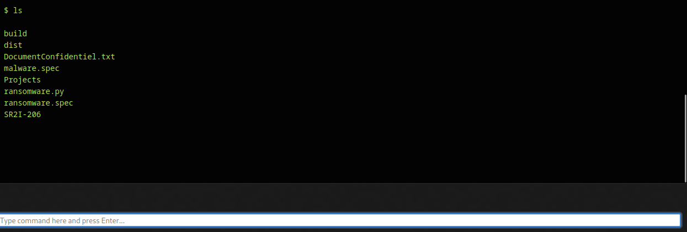

# DL-based-malware-detection
Warning: Only use this software according to your current legislation. Misuse of this software can raise legal and ethical issues which I don't support nor can be held responsible for.

# I. Introduction

Les botnets, dans le domaine de la cybersécurité, sont des réseaux de machines infectées contrôlées à distance par un acteur malveillant, souvent appelé le "botmaster" ou le "herder". Ces réseaux ont émergé comme un vecteur puissant pour une multitude d'activités malveillantes, y compris le déni de service distribué (DDoS), le vol de données, le spam, le phishing, la propagation de ransomwares, la cryptominage illicite, et bien d'autres.

Depuis les années 2000, les botnets ont évolué pour devenir plus sophistiqués et robustes, échappant à la détection par les mesures de sécurité traditionnelles et persistant dans leurs hôtes infectés. Parmi ces botnets, le botnet Ares se distingue comme un exemple illustratif de l'évolution contemporaine de ces menaces.


# I.1 Architecture des Botnets

Traditionnellement, les botnets étaient organisés en architectures centralisées, où tous les bots étaient directement contrôlés par un serveur central. Cependant, pour éviter la détection et la démantèlement, de nombreux botnets ont adopté des architectures peer-to-peer (P2P) où chaque bot agit à la fois comme client et serveur, partageant les instructions et les mises à jour à travers le réseau. Ce qui permet à l'attaquant de limiter les chances d'être retrouvé.


Contrairement à l'arthitecture centralisé client serveur:


# Cas du botnet Ares

Ares est un botnet open source conçu à des fins éducatives et de recherche en cybersécurité1. Il offre une démonstration concrète de l'architecture des botnets, de la propagation et de la commande à distance. En raison de sa conception open source, Ares peut être personnalisé pour fonctionner sur une variété de systèmes, y compris Windows.

# Presentation du projet

Le but de ce projet est de cerner les enjeux qu'impliquent les botnets et de pouvoir analyser leurs comportements. Nous allons donc compiler et analyser un botnet Ares, disponible sur github. Puis, nous allons chercher à infecter une machine virtuelle Windows en utilisant agent.py converti en .exe à l'aide de ```pyinstaller```. Cet executable sera camouflé par une icone d'excel banale.

# Mise en place

Nous commençons l'installation en suivant les instructions mentionnées sur le github: https://github.com/sweetsoftware/Ares.
Vous êtes invité à vous y rendre si vous souhaitez réaliser l'installation. 

Nous lançons le serveur à l'aide de la commande: 

```./ares.py runserver -h 0.0.0.0 -p 8080 --threaded```

Nous commençons par la configuration du compte admin:


Nous voilà alors au panel ou nous pouvons surveiller nos agents.


Nous pouvons voir que nous avons déjà une machine infecté, "zombie", sur notre réseau qui est l'une des machines virtuelles que j'ai préalablement infecté. Nous pouvons voir la localisation, l'IP, l'os et le statut (online ou offline) mais ce n'est pas le plus impressionant. Le plus impressionant est le fait que l'on puisse controler le Shell de notre victime.

Par exemple, nous pouvons fouiller dans la machine pour trouver si des fichiers sont intéressants.



Oh mais nous remarquons qu'il y'a un fichier nommé "DocumentConfidentiel.txt", ça doit être sacrément intéressant. Pouvons-nous le télécharger par exemple? 

Bien sûr: 


Les possibilités sont multiples, nous pouvons prendre un screenshot de l'ordinateur de la victime, uploader, télécharger, executer n'importe quelle commande shell, script python etc...

Voici la liste des commandes possibles: 


Nous avons vu l'eventail de possibilités que nous avons lorsque la victime a été infecté mais comment faire pour infecter une victime?

# L'infection de la victime

Pour cela, il suffit de compiler le fichier ```agent.py``` sur l'ordinateur de la victime. L'idéal pour nous serait de le transformer en executable camouflé en excel pour que la victime l'execute sans se rendre compte qu'elle a été infecté. 
Par exemple, voici le fichier qui infecterait la victime: 


Lorsque la victime ouvre ce fichier, elle pense qu'il s'agit simplement d'un document Excel. Cependant, en arrière-plan, le fichier agent.py est exécuté, connectant l'ordinateur de la victime au serveur Ares et ajoutant ainsi l'ordinateur à notre botnet.

Créer un tel document nécessite une certaine familiarité avec l'outil pyinstaller, qui est capable de convertir des scripts Python en exécutables Windows. De plus, pour rendre l'exécutable moins suspect, nous avons changé l'icône de l'exécutable pour qu'elle ressemble à une icône Excel standard.

La commande utilisée pour réaliser cette opération est :

```pyinstaller --onefile --icon=my_icon.ico agent.py```

Où my_icon.ico est l'icône Excel que nous utilisons pour masquer notre exécutable.


# Conclusion

Dans le cadre de ce projet, nous avons vu comment un botnet comme Ares peut être utilisé pour infecter des machines et comment il peut être contrôlé à distance. Nous avons également démontré les diverses fonctionnalités et les différentes commandes qui peuvent être exécutées sur une machine infectée.

Il est important de souligner que cette démonstration a été réalisée à des fins éducatives et de recherche uniquement. L'objectif est d'améliorer notre compréhension des botnets et de développer des stratégies pour les contrer.

L'utilisation de botnets à des fins malveillantes est illégale et contraire à l'éthique. De plus, l'ouverture de fichiers provenant de sources inconnues ou suspectes est un risque de sécurité majeur. Il est donc important de toujours faire preuve de prudence lors de l'ouverture de fichiers et de toujours maintenir à jour ses logiciels de sécurité.


